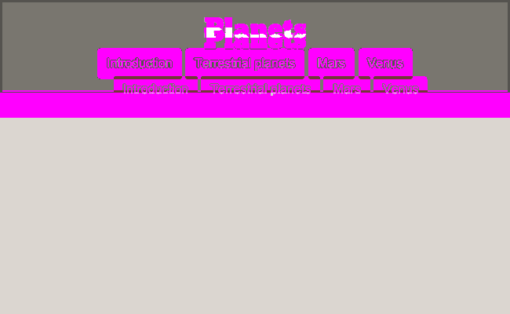

#  Markbot

*Your friendly neighbourhood marking robot.*


**This is an application I use that automatically tests and marks student code assignments in Algonquin College Graphic Design’s Web Dev courses.**

Built with Javascript, Node.js & Electron.

---

- [Why a desktop app?](#why-a-desktop-app)
- [Use cases](#use-cases)
- [Set up](#set-up)
- [How the students use it](#how-the-students-use-it)
- [Repo configuration with Markbot files](#repo-configuration-with-markbot-files)
  - [HTML file tests](#html-file-tests)
  - [CSS file tests](#css-file-tests)
  - [JS file tests](#javascript-file-tests)
  - [Screenshot comparisons](#screenshot-comparisons)
- [Installation on student computers](#installation-on-student-computers)
  - [Git](#git)
  - [JDK](#jdk)
  - [Student installation tutorial](#student-installation-tutorial)
- [Building Markbot](#building-markbot)
  - [Configure the Markbot application](#configure-the-markbot-application)
  - [Markbot dependencies](#markbot-dependencies)
    - [HTML validator](#html-validator)
    - [CSS validator](#css-validator)
      - [Compiling the CSS validator](#compiling-the-css-validator)
  - [Running Markbot](#running-markbot)
- [Debugging Markbot](#debugging-markbot)
- [Markbot Server](#markbot-server)
- [License & copyright](#license--copyright)

---

## Why a desktop app?

This is my second (and more successful) attempt. The first version was built on GitHub Pull Requests & Travis with MochaJS tests.

Unfortunately version one had some problems: specifically volume. In classes of 25 or more students Travis would start to choke at the end when everybody was trying to finish their work on time. There would be upwards of 25 pull requests going into Travis per minute with many requested tests to complete. It was just too slow, sometimes tests would take 20–30 minutes to complete, or just stop.

The user experience wasn’t great for the students and also a little stressful for me, so I switched to a desktop app built with [Electron](http://electron.atom.io/) and (practically) the same Javascript tests.

Having the desktop app allows all the tests to be run locally and much more efficiently.

---

## Use cases

Students will fork assignment repositories from GitHub, make their changes, and drop it into Markbot. Markbot will run a battery of tests on the code and report back with the results, allowing the finalized work to be submitted to the Canvas LMS.

This is great for code assignments that are pass/fail—I use it in my courses. If they pass the tests then the system automatically sets their grade to complete in Canvas.

It also works for non-pass/fail assignments but the grade submission component will only assign 1 point to their assignment—which I think makes sense because, I as the teacher, would then go in and do a complete assessment of their work.

---

## Set up

There’s a few things you’ll need to do to set the repo up properly for Markbot.

1. Create a [build of the Markbot.app](#building-markbot) that points to your version of [Markbot Server](#markbot-server).
2. Create a repo on GitHub with a `.markbot.yml` file inside—[see Markbot configuration below](#configuration-with-markbot-files).
3. I usually put `.editorconfig` and `.gitignore` files in the repo to help the students not make simple mistakes. [See the Markbot repo template on GitHub.](https://github.com/thomasjbradley/markbot-template)
4. I usually make sure the repo is set up with `gh-pages` so it is a live website for the students.
5. Get the students to [download Markbot and it’s dependencies onto their computers](#installation-on-student-computers).
6. Use Markbot while coding…

---

## How the students use it

The students will fork repos then drop into Markbot which will automate the marking.

[**Check out this tutorial for the students to see how it works.**](http://learn-the-web.algonquindesign.ca/courses/web-dev-1/using-markbot/)

---

## Repo configuration with Markbot files

All the tests are set up and ready to go and inside the Markbot application. They can be configured from a `.markbot.yml` file.

*Place the `.markbot.yml` file in the folder you want to test. Normally this is done when setting up a repository on GitHub that students would fork.*

Here are the properties that you can use in the Markbot file for testing:

- `repo` — used as an indicator in the app screen & as part of the [Canvas integration](https://github.com/thomasjbradley/travis-canvas-proxy) to make nice URLs in grading comments.
- `canvasCourse` — used as part of the Canvas integration.
- `canvasAssignment` — used as part of the Canvas integration.
- `naming` — will confirm every file & folder follows [our naming conventions](http://learn-the-web.algonquindesign.ca/topics/naming-paths-cheat-sheet/).
- `commits` — the minimum number of commits students need—will automatically subtract your commits.
- `html` — [for testing HTML files.](#html-file-tests)
- `css` — [for testing CSS files.](#css-file-tests)
- `js` — [for testing Javascript files.](#javascript-file-tests)
- `screenshots` — [for comparing visual differences with screenshots.](#screenshot-comparisons)

**If you plan on using the Canvas auto-grading feature, check out [Markbot Server](#markbot-server).**

### HTML file tests

Use the `html` entry to test HTML files, it’s an array of objects, each representing a file to test.

*The `path` option is the only one that’s required—leaving any of the others off will skip the test.*

```yml
html:
    # The HTML file’s path
  - path: 'index.html'

    # Whether to validate it or not
    valid: true

    # Check its best practices & indentation (double quoting attributes, having a <title>, indented children, etc.)
    # Can be further configured in the `htmlcs.json` file
    # Will be skipped if validation isn’t also checked—the document must be valid before best practices are tested
    bestPractices: true

    # Can be used to test for specific elements; each entry should be a valid CSS selector
    has:
      - 'header nav[role="navigation"]'
      - 'main'

    # Regex searches on the file, for confirming specific content
    search:
      - 'Hello World!'
```

### CSS file tests

Use the `css` entry to test CSS files, with many of the same options as the HTML.

```yml
css:
    # The CSS file’s path
  - path: 'css/main.css'

    # Whether to validate it or not
    valid: true

    # Check its best practices & indentation (spaces after colons, new lines after closing blocks, etc.)
    # Can be further configured in the `stylelint.json` file
    # Will be skipped if validation isn’t also checked—the document must be valid before best practices are tested
    bestPractices: true

    # Can be used to test for specific selectors, properties & values
    #   [selector, property (optional), value (optional)]
    has:
      - ['.thing']
      - ['.super', 'background-image']
      - ['.thang', 'width', '50px']

    # Regex searches on the file
    search:
      - '@keyframes'
```

### Javascript file tests

Use the `js` entry to test Javascript files, with many of the same options as the HTML.

```yml
js:
    # The JS file’s path
  - path: 'js/main.js'

    # Whether to validate/lint it or not using a series of best practices
    # Can be further configured in the `validation/eslint.json` file
    valid: true

    # Check its best practices & indentation (semicolons, spacing around brackets, etc.)
    # Can be further configured in the `best-practices/eslint.json` file
    # Will be skipped if validation isn’t also checked—the document must be valid before best practices are tested
    bestPractices: true

    # Regex searches on the file
    search:
      - 'querySelector'
      - 'addEventListener'
```

### Screenshot comparisons

Markbot can be used to compare student work against reference screenshots included in the repository.

```yml
screenshots:
    # The path to the HTML file that will be screenshot
  - path: 'index.html'
    # An array of different screen widths for taking screenshots
    sizes: [400, 650, 960]
```

*Markbot will look in the `screenshots` folder for images to compare against.*

The screenshots should be generated using Markbot itself for the most consistency—trigger the “Develop” menu (`Shift+Esc`) and press “Generate Reference Screenshots”.

Markbot will display differences to students highlighted in a bright colour. Difference percentages are calculated and **anything with a difference greater than 10% is considered an error.**



*An example of screenshot difference errors.*

---

## Installation on student computers

Before getting Markbot working on student machines, these two things should be downloaded and installed on the user’s computer.

### Git

Use the Mac OS X Terminal and install the command line tools with `xcode-select --install`

On Windows, [install Git directly from the website](https://git-scm.com/download/win). *When installing, on the “Adjusting your PATH environment” screen, switch to “Use Git from the Windows Command Prompt”.*

### JDK

Because Markbot shells out to two JAR files, the JDK must be available on the user’s computer.

[**Download the JDK.**](http://www.oracle.com/technetwork/java/javase/downloads/jdk8-downloads-2133151.html)

### Student installation tutorial

Check out my lesson for the students on installing it on their computers.

*Specifically starting at set 13:* [**Student Markbot installation lesson.**](http://learn-the-web.algonquindesign.ca/courses/web-dev-1/install-all-the-things/#step-13)

---

## Building Markbot

Markbot uses Javascript, [Node.js](https://nodejs.org/en/), and [Electron](http://electron.atom.io/) as its build platform.

First clone Markbot to your computer using Git:

```
git clone git@github.com:thomasjbradley/markbot.git
```

If you’re using a Mac, I’d suggest installing Node.js with [Homebrew](http://brew.sh/).

```
brew install node
cd markbot
npm install
```

### Configure the Markbot application

To configure your installation of Markbot you’ll need to adjust the config file.

Rename `config.example.json` to just `config.json` and change the following options:

- `proxyUrl` — (string) the URL to your [Markbot Server](#markbot-server) instance.
- `ignoreCommitEmails` — (array) the list of email addresses to ignore when counting commits.

### Markbot dependencies

Markbot has a few external dependencies that it shells out to internally:

- Git
- Nu HTML validator (JAR)
- CSS validator (JAR)

The `vendor` folder should contain a bunch of JAR files for the HTML validator and the CSS validator.

#### HTML validator

The `vendor` folder should contain the `vnu.jar`—the pre-built binary works well.

[**Download the HTML validator release from GitHub.**](https://github.com/validator/validator)

#### CSS validator

The pre-build JAR files seem to be out of date, so you’ll have to compile the JAR yourself.

[**Download the CSS validator source from GitHub.**](https://github.com/w3c/css-validator).

##### Compiling the CSS validator

You’ll need the JDK and `ant` to compile the validator. Install `ant` with Homebrew: `brew install ant`.

1. Move into the directory and run `ant jar`.
2. Move the `css-validator.jar` file into the `vendor` folder.
3. Move the newly created `lib` folder and all its contents into the `vendor` folder.

### Running Markbot

If you want to run a test version, you can call `start`:

```
npm start
```

To build a final application for deployment to students, run `build`:

```
npm run build
```

*This will create both the Mac OS X version and the Windows version.*

Or optionally a single platform:

```
npm run build:osx
npm run build:win
```

That’s it, Markbot should be ready to go.

---

## Debugging Markbot

Markbot has access to the developer tools and web inspector as well as a few other tools hidden in the “Develop” menu.

**To enable the “Develop” menu press `Shift+Esc`.**

---

## Markbot server

**Markbot Server is a companion server-side component ot the desktop application.**

It’s used for the purpose of connecting Markbot to Canvas. Everything is on a separate server to keep my own personal Canvas API key secret, and to create a mapping for student GitHub usernames to Canvas student IDs.

Markbot will send its current version number to Markbot Server to help prevent students from using outdated versions of Markbot.

[**Find out more about Markbot Server.**](https://github.com/thomasjbradley/markbot-server)

---

## License & copyright

© 2016 Thomas J Bradley — [GPL](LICENSE).
