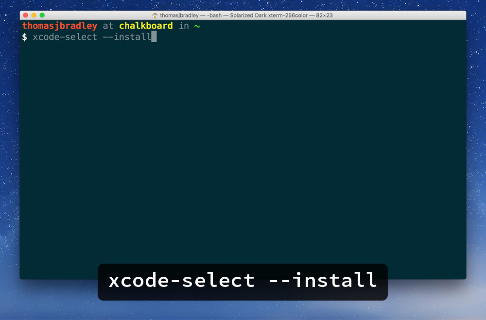

# Install the Git command-line tools on MacOS

*Markbot requires a few extra tools installed on your computer to function properly.*

**The Git command-line tools allow Markbot to check your commits & push status, etc.**

Open the application on your computer called “Terminal”, it’s inside `Applications > Utilities`.

Type exactly this:

```
xcode-select --install
```

Hit `Return`

It will guide you through the download and installation process.



*That’s all!*
