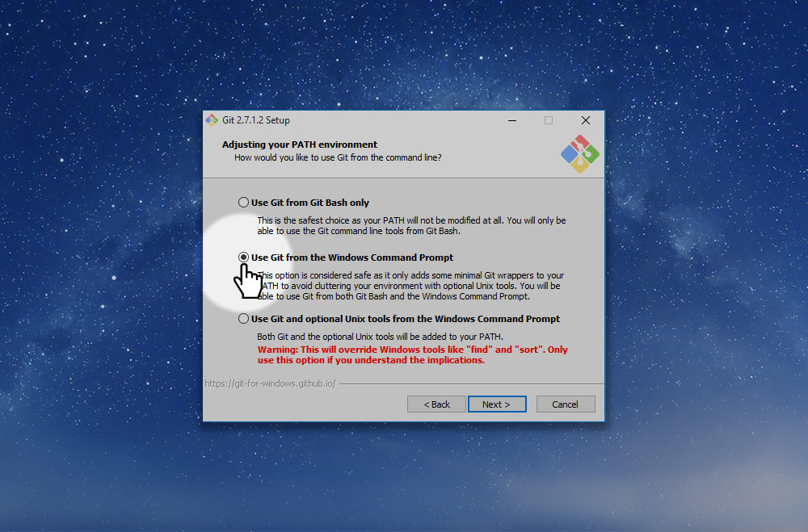

# Install the Git command-line tools on Windows

*Markbot requires a few extra tools installed on your computer to function properly.*

**The Git command-line tools allow Markbot to check your commits & push status, etc.**

**Go to [Git’s download page](https://git-scm.com/download/win) and download the Windows version.**

Install Git onto your computer. One of the setup screens has options we have to change.

*On the “Adjusting your PATH environment” screen, switch to “Use Git from the Windows Command Prompt”.*

*That’s all!*
