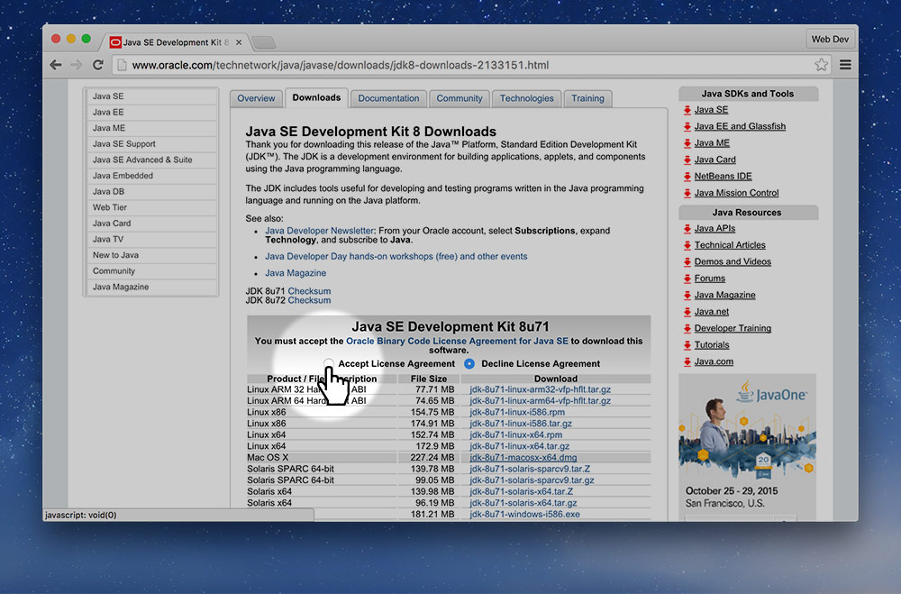
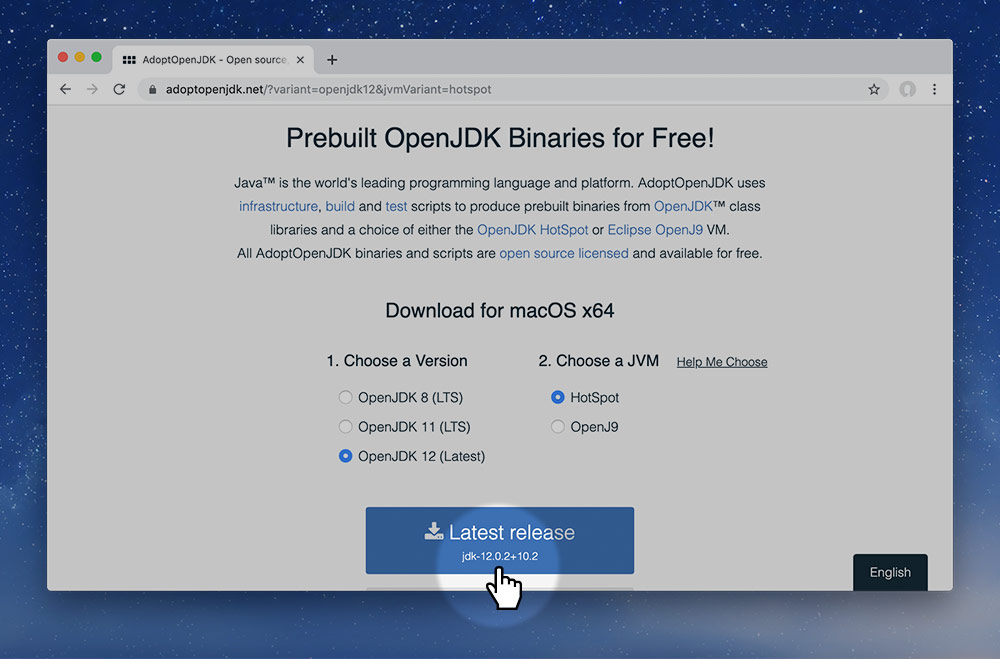

# Install the Java Development Kit on MacOS

*Markbot requires a few extra tools installed on your computer to function properly.*

**The Java Development Kit allows Markbot to run the HTML validator, CSS validator & and the language checker.**

Go to the JDK download page on [Oracle’s Java Downloads](https://www.oracle.com/technetwork/java/javase/downloads/jdk12-downloads-5295953.html) website.

*Don’t forget to accept the license agreement.*

1. Download the JDK for your computer.
2. Mount the disk image by double clicking.
3. Double click the installer and let it do its thing.
4. Eject the mounted disk from your computer.
5. Delete the downloaded file.

*That’s all!*
